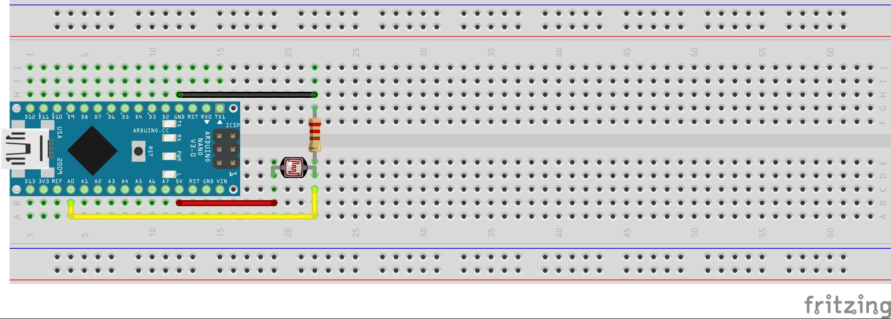
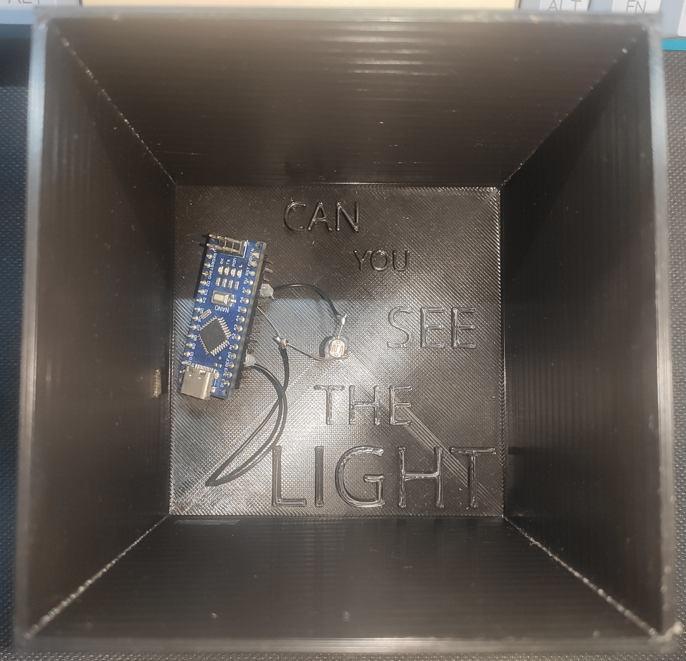

# Light Sensor Interaction

The Light Sensor Interaction is a mini game that was developed for my Master Thesis "Developing a Support Infrastructure for an Escape The Room and Peddy Paper Games".

This mini game, or interaction as I so call it, was developed to be part of an Escape the Room game that was also developed as part of my thesis. Since this interaction can work as a standalone mini game I decided to place it here for anyone interested in using it.

## List of Components

- LDR - Light Controlled Resistor (1x);
- 220Ω Resistor (1x);
- Arduino Nano (1x);

In order to fully assemble the Interaction, so as to look like the picture below, you will also need to 3D Print the enclosure which is divided into two parts that can be found [here](enclosure/).

## The Purpose of The Game

There is actually not a lot to say about the Light Sensor Interaction. When it was integrated in the Escape The Room this interaction served the main purpose of being activated by a flashlight that the players had to obtain by solving other mini games. It is still a very good way of teaching how LDR sensors work and creating playful experiences using this interaction.

## Instructions

First start by uploading the code to your Arduino Nano (This is the one I used so I can only guarantee proper working with this micro-controller).

### Starting the Game

To start the game you must first type in the Arduino IDE serial monitor the following:

- > COM:START;ID:123456789

This command will then print in the Serial Monitor the solution of the game which then needs to be introduced using the keypad. If the introduced code is correct then the following message will appear in the serial monitor:

- > COM:INTERACTION_SOLVED;MSG:User Iluminated LDR Sensor;PNT:1750

## Warning

The source code for this interaction contains a lot of logic that was made to communicate with the infrastructure that was developed for my thesis and therefor it is not as clean as it could be when compared to a mini game that is developed with the intent of being used by the Arduino IDE directly.